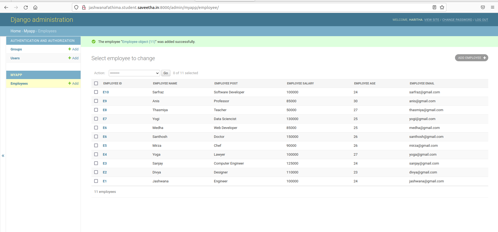

# Django ORM Web Application

## AIM
To develop a Django application to store and retrieve data from a database using Object Relational Mapping(ORM).

## Entity Relationship Diagram

## DESIGN STEPS

### STEP 1:
Clone the repository to theia ide. start a new app inside the project folder

### STEP 2:
Tyoe the appropriate code for your table and provide appropriate data types to the
columns.

### STEP 3:
Create a report about your project in readme.md file and upload the django.orm.pp
folder to your remote repository

Write your own steps

## PROGRAM
from django.db import models

from django.contrib import admin

class Employee(models.Model):

      Employee_id=models.CharField(max_length=8,help_text="Employee ID")
      Employee_name=models.CharField(max_length=100)
      Employee_post=models.CharField(max_length=100)
      Employee_salary=models.IntegerField()
      Employee_age=models.IntegerField()
      Employee_email=models.EmailField()

class EmployeeAdmin(admin.ModelAdmin):

    list_display=('Employee_id','Employee_name','Employee_post','Employee_salary','Employee_age','Employee_email')      

## OUTPUT

## RESULT
Hence we developed a Django application to store and retrieve data from a database
using Object Relational Mapping(ORM).